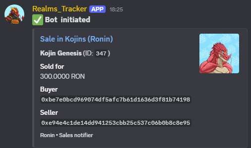

<<<<<<< HEAD
# 🐉 Realms Tracker

A Python-based bot for tracking **NFT sales and events** in the Realms ecosystem, focusing on **Kojins** and **Mounts** collections (with plans to expand to more NFTs).

---


 


## 📌 Project Overview

**Features:**
- Automated polling of Ronin/OpenSea APIs (configurable interval).
- Discord notifications for new sales/events.
- Free-tier hosting on Google Cloud (24/7 uptime).

**Built with:**
- Python + aiohttp (async API calls).
- discord.py for Discord integration.
- GraphQL for Ronin queries.

---

## 🛠️ Key Features

| Feature              | Description                                                                 |
|----------------------|-----------------------------------------------------------------------------|
| Configurable Polling | Default: 120 sec (to stay within GCP free tier limits).                     |
| Efficient Tracking   | Fetches up to 100 events per call.                                          |
| No Duplicates        | Stores last sales in `last_sales.json`.                                     |
| Discord Alerts       | Formatted embeds with buyer/seller info, price, and links.                  |

---

## 📂 Files & Structure

```
Test_bot/
├── bot.py             # Main script (Discord bot + polling loop)
├── sales_listener.py  # Handles API queries & data processing
├── query.py           # Query helpers/utilities
├── test_env.py        # Environment/test helpers
├── image.png          # Project image/logo
├── images/
│   └── image.png      # Example image asset
├── __init__.py        # Package marker
├── __pycache__/       # Python cache files
├── README.md          # This file
└── ...                # Other files (e.g., config, .env, .gitignore)
```

---

## 🚀 Setup & Deployment
🔧 Local Setup
Clone the repo:

bash
Copiar
Editar
git clone https://github.com/alva-p/realms_tracker.git
bash

Install dependencies:

```bash
pip install -r requirements.txt
```

---


## 🔗 Resources

- 🌐 [Realms Official Site](https://roninrealms.com/)
- 🖼️ [Kojin NFTs](https://marketplace.skymavis.com/collections/kojin)
- 🐴 [Mounts NFTs](https://marketplace.roninchain.com/collections/realmsmounts)

---

## 💡 Future Improvements

- Add support for more Realms NFTs.
- Optimize API polling efficiency.
- Multi-marketplace integration.

Contributions welcome! Open an issue or PR.

---

<div align="center">
	<strong>✨ P.S. ¡shout out to <span style="color:#e63946;">Berlin</span>! ✨</strong>
=======
# 🐉 Realms Tracker

A Python-based bot for tracking **NFT sales and events** in the Realms ecosystem, focusing on **Kojins**, **Mounts** and **Tickets** collections (with plans to expand to more NFTs).

---


## 📌 Project Overview

**Features:**
- Automated polling of Ronin/OpenSea APIs (configurable interval).
- Discord notifications for new sales/events.
- Free-tier hosting on Google Cloud (24/7 uptime).

**Built with:**
- Python + aiohttp (async API calls).
- discord.py for Discord integration.
- GraphQL for Ronin queries.

---

## 🛠️ Key Features

| Feature              | Description                                                                 |
|----------------------|-----------------------------------------------------------------------------|
| Configurable Polling | Default: 120 sec (to stay within GCP free tier limits).                     |
| Efficient Tracking   | Fetches up to 100 events per call.                                          |
| No Duplicates        | Stores last sales in `last_sales.json`.                                     |
| Discord Alerts       | Formatted embeds with buyer/seller info, price, and links.                  |

---

## 📂 Files & Structure

```
Test_bot/
├── bot.py             # Main script (Discord bot + polling loop)
├── sales_listener.py  # Handles API queries & data processing
├── query.py           # Query helpers/utilities
├── test_env.py        # Environment/test helpers
├── image.png          # Project image/logo
├── images/
│   └── image.png      # Example image asset
├── __init__.py        # Package marker
├── __pycache__/       # Python cache files
├── README.md          # This file
└── ...                # Other files (e.g., config, .env, .gitignore)
```

---

## 🚀 Setup & Deployment
🔧 Local Setup
Clone the repo:

bash
Copiar
Editar
git clone https://github.com/alva-p/realms_tracker.git
bash

Install dependencies:

```bash
pip install -r requirements.txt
```

---


## 🔗 Resources

- 🌐 [Realms Official Site](https://realms.game/)
- 🖼️ [Kojin NFTs](https://marketplace.skymavis.com/collections/kojin)
- 🐴 [Mounts NFTs](https://marketplace.roninchain.com/collections/realmsmounts)
- 🎟️ [Tickets NFTs] (https://marketplace.roninchain.com/collections/realms-tickets)

---

## 💡 Future Improvements

- Add support for more Realms NFTs.
- Optimize API polling efficiency.
- Multi-marketplace integration.

Contributions welcome! Open an issue or PR.

---

<div align="center">
	<strong>✨ P.S. ¡shout out to <span style="color:#e63946;">Berlin</span>! ✨</strong>
>>>>>>> 3c4d737 (update readme)
</div>