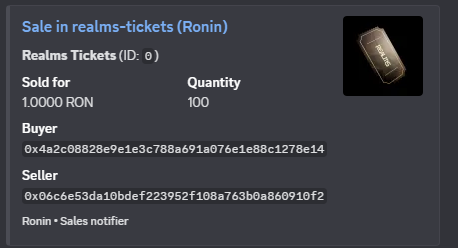

🐉 Realms Tracker
A Python-based bot for tracking NFT sales and events in the Realms ecosystem, focusing on Kojins and Mounts collections (with plans to expand to more NFTs).

📌 Project Overview
Monitors NFT marketplaces for the Realms project on Ronin chain. Features:

Automated polling of Ronin/OpenSea APIs (configurable interval).

Discord notifications for new sales/events.

Free-tier hosting on Google Cloud (24/7 uptime).

Built with:

Python + aiohttp (async API calls).

discord.py for Discord integration.

GraphQL for Ronin queries.

🛠️ Key Features
Feature	Description
Configurable Polling	Default: 120 sec (to stay within GCP free tier limits).
Efficient Tracking	Fetches up to 100 events per call.
No Duplicates	Stores last sales in last_sales.json.
Discord Alerts	Formatted embeds with buyer/seller info, price, and links.
📂 Files & Structure
plaintext
realms_tracker/  
├── bot.py               # Main script (Discord bot + polling loop).  
├── sales_listener.py    # Handles API queries & data processing.  
├── last_sales.json      # Tracks recent sales to avoid duplicates.  
├── .env                 # Config (API keys, tokens, etc.) - NOT committed.  
├── .gitignore           # Excludes secrets/cache files.  
└── README.md            # This file.  
🚀 Setup & Deployment
Local Setup
Clone the repo:

bash
git clone https://github.com/alva-p/realms_tracker.git
Install dependencies:

bash
pip install -r requirements.txt  # Ensure discord.py, aiohttp, python-dotenv are listed.
Create .env (copy from example):

ini
DISCORD_TOKEN=your_token_here
CHANNEL_ID=your_channel_id
RONIN_API_URL=https://...
Cloud Deployment (GCP Free Tier)
Spin up an e2-micro VM (Ubuntu 22.04).

Run the bot 24/7 with PM2:

bash
pm2 start bot.py --interpreter=python3
🔗 Resources
🌐 Realms Official Site

🖼️ Kojin NFTs

🐴 Mounts NFTs

💡 Future Improvements
Add support for more Realms NFTs.

Optimize API polling efficiency.

Multi-marketplace integration.

Contributions welcome! Open an issue or PR.

P.S. ¡shout out to Berlin! 